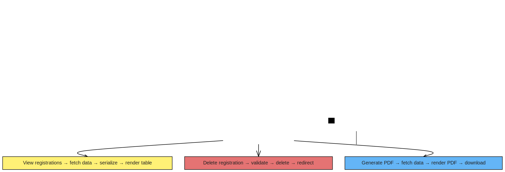

# 🚀 Forge Byte Registration Portal

A **secure, scalable, and backend-focused** web-based registration system built with **Django**, designed to manage user onboarding efficiently and reliably.

---

## 📌 Overview

The **Forge Byte Registration Portal** is a robust web application that streamlines user registration and data management. It focuses on **security**, **maintainability**, and **extensibility**, making it a solid foundation for production-ready systems.

The project follows **industry-standard Django development practices**, offering a clean architecture, structured workflows, and a powerful administrative interface.

## Project Flowchart


---

## ✨ Key Features

- ✅ User registration with **server-side validation**
- 🔐 Secure password hashing using **Django Authentication**
- 🛠️ Admin dashboard for managing registered users
- 🗃️ Structured and normalized **relational database**
- 🧩 Clean, modular Django project structure
- 🔄 Easily extensible for future enhancements

---

## 🧰 Technology Stack

| Technology | Description |
|-----------|------------|
| 🐍 Python | Core programming language |
| 🌐 Django | Web application framework |
| 🧬 Django ORM | Database abstraction layer |
| 🗄️ SQLite / PostgreSQL | Configurable database |
| 🧱 HTML5 | Frontend structure |
| 🎨 CSS / Bootstrap | Styling and layout |
| 🧑‍💼 Django Admin | Administrative interface |

---

## 🏗️ Architecture

The application follows Django’s **MVT (Model–View–Template)** architecture:

- **Models** → Define data structures and database schema  
- **Views** → Handle request processing and business logic  
- **Templates** → Render the user interface  

### 🔁 Application Flow

User → Web Interface → Django Views → Database
↓
Admin Panel

yaml
Copy code

---

## 🗄️ Database Design

The system uses a **relational database** to manage user data, including:

- Personal details  
- Contact information  
- Authentication credentials  

The **Django ORM** ensures secure, efficient, and scalable database interactions.

---

## 🔐 Security

Security is implemented using Django’s built-in protections:

- 🔒 Secure password hashing
- 🛡️ CSRF protection enabled by default
- ✅ Input validation to prevent malformed data
- ⚙️ Sensitive configuration isolated from source code

---

## ⚙️ Installation

### 📋 Prerequisites

- Python **3.9+**
- `pip`
- Virtual environment (**recommended**)

---

### 🛠️ Setup Steps

#### 1️⃣ Clone the repository

```bash
git clone https://github.com/cooperverse/forge_byte_registration_portal.git
cd forge_byte_registration_portal
2️⃣ Create and activate a virtual environment
bash
Copy code
python -m venv venv
source venv/bin/activate      # Linux/macOS
venv\Scripts\activate         # Windows
3️⃣ Install dependencies
bash
Copy code
pip install -r requirements.txt
4️⃣ Apply migrations
bash
Copy code
python manage.py migrate
5️⃣ Run the development server
bash
Copy code
python manage.py runserver
6️⃣ Open in your browser
cpp
Copy code
http://127.0.0.1:8000/
🧪 Testing
Manual functional testing was performed to verify:

✔️ Registration workflow

✔️ Data persistence

✔️ Admin panel functionality

✔️ Overall application stability

The project structure supports future automated testing using Django’s testing framework.

🚀 Future Improvements
📧 Email verification and notifications

🧑‍🤝‍🧑 Role-based access control

🔌 REST API support

🎨 UI/UX enhancements

☁️ Deployment-ready configuration

📊 Logging and monitoring

📄 License
This project is licensed under the MIT License.

You are free to use, modify, and distribute this software in accordance with the license terms.
See the LICENSE file for full details.

🤝 Contributing
Contributions are welcome! 🎉

Fork the repository

Create a feature branch

Commit changes with clear messages

Submit a pull request

📬 Contact
Author: Cooper
GitHub: https://github.com/cooperverse
